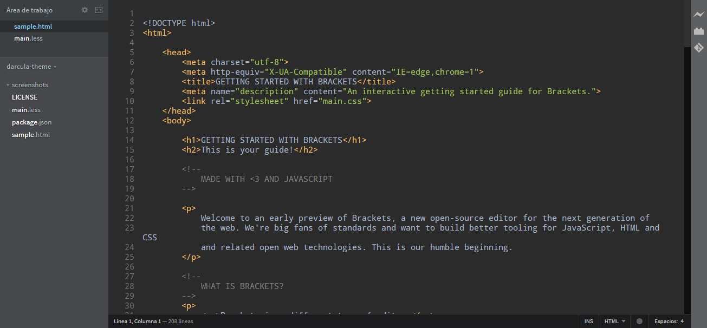
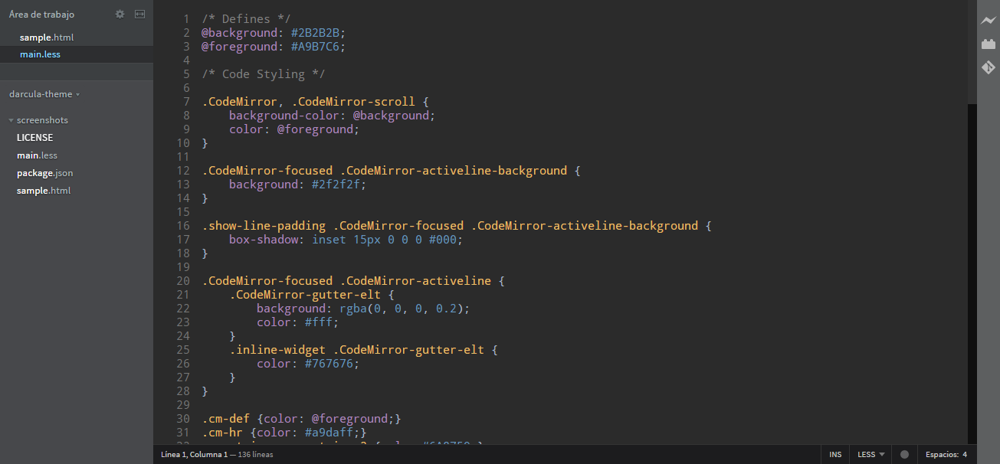
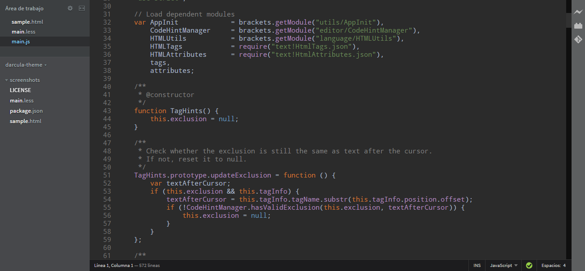

Brackets Theme: Darcula
===

This theme is based on the _Darcula_ color scheme from [JetBrains WebStorm](https://www.jetbrains.com/webstorm/).

Screenshots
---

### HTML

### CSS

### JavaScript

Installation
---

This extension requires Brackets Release 1.1 or newer.

1. Open Brackets
2. Open the Extension Manager
3. Switch to "Themes" tab
4. Search for "Darcula"
5. Click "Install"

License
---

The MIT License. Read [LICENSE](LICENSE) for further information.